
<h1 align="center">应急资源管理系统</h1>

## 简介
应急资源管理系统：角色分为管理员、应急科技人才；功能包括用户管理、团队管理、研发平台管理、基础设施管理、科研成果管理、设备信息管理和资料库管理。    --计算机毕业设计源码；毕设源码；java毕业设计源码

## 联系方式

<h3 align="center">获取完整代码与数据库文件 + 微信：deepguan QQ: 86050149 QQ群: 783742310</h3>

<h3 align="center">可帮忙远程部署 包运行成功！提供远程部署、修改代码、设计文档指导、代码讲解等服务！</h3>

## 功能介绍（完整见运行截图）
管理员： 提供登录、注册、退出功能，管理个人信息，支持用户数据的增删改查；管理应急科技团队，录入团队信息及相关文件；管理研发平台及其项目内容，提供修改和删除操作；管理基础设施，上传设施图片并编辑简介；管理科研成果，录入研发成果名称、团队及完成时间，支持文件上传和编辑；管理科技装备和资料库信息，支持设备及文档内容的上传和编辑；提供导航栏切换和分页查看功能。

应急科技人才： 可通过注册和登录访问系统，根据权限查看个人信息及修改个人资料；参与科研团队管理，上传团队简介，查看和更新负责的研发项目；编辑基础设施和科研成果信息，上传相关文档和图片，确保资源信息准确完整；协助设备和资料管理，输入设备名称，编辑设备简介，维护资料库信息；提交和确认资源更新，为应急管理提供数据支持。

## 运行截图
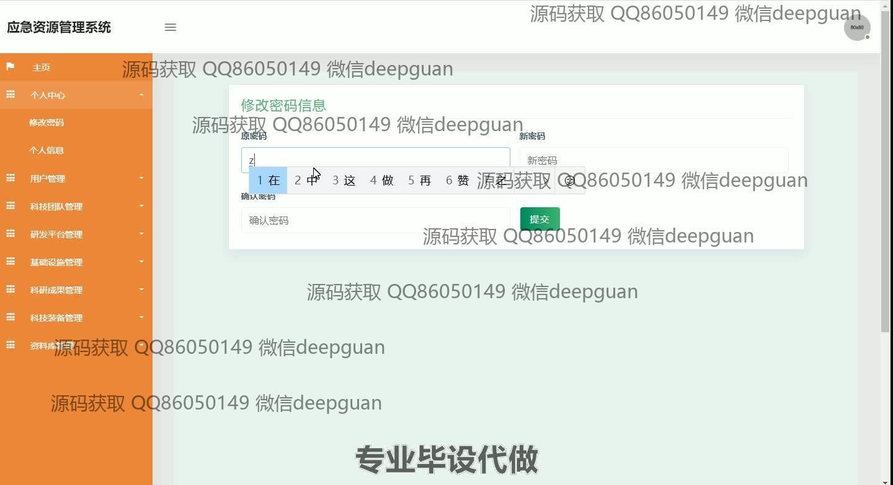
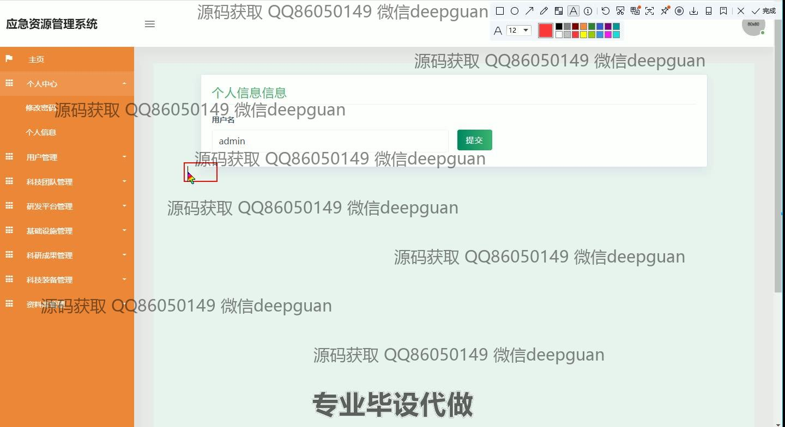
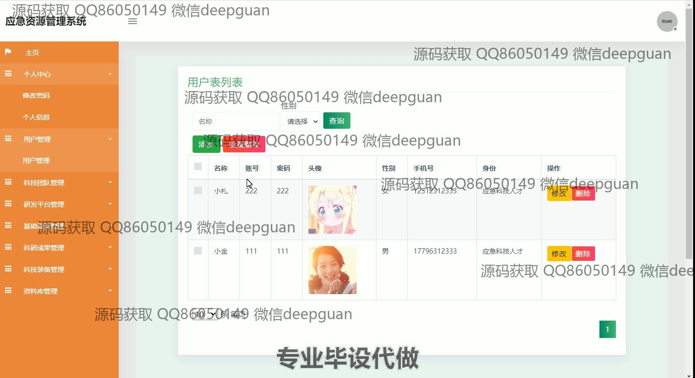
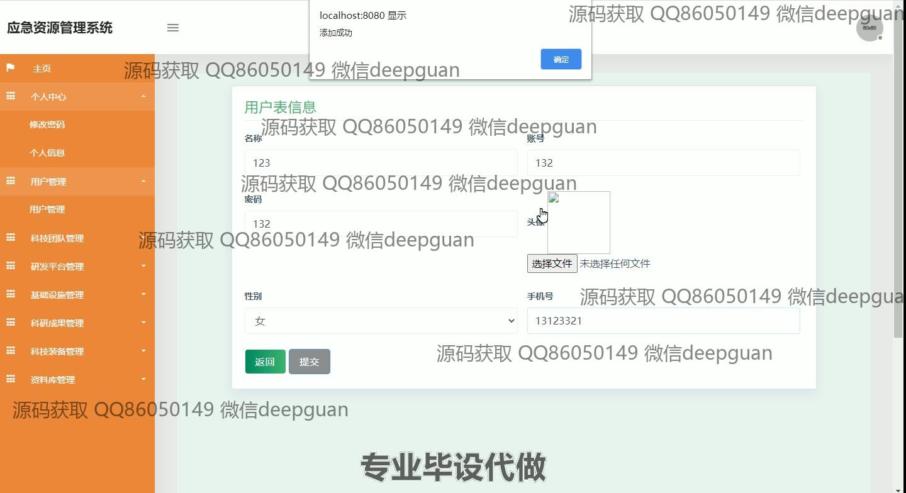
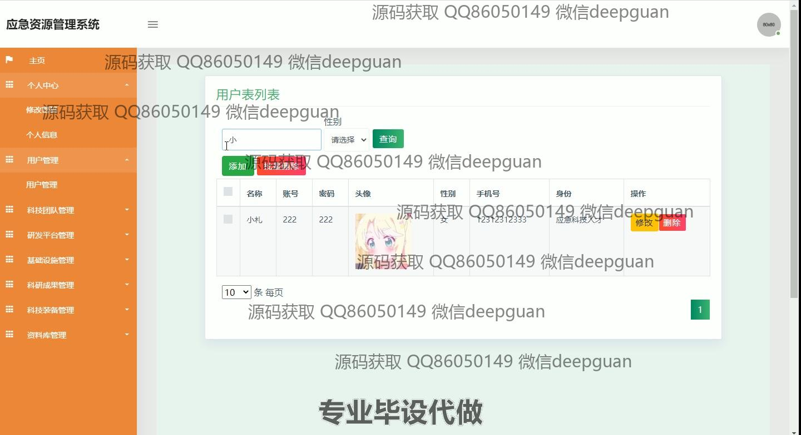
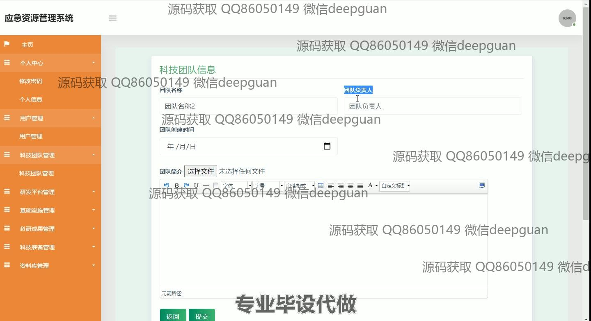
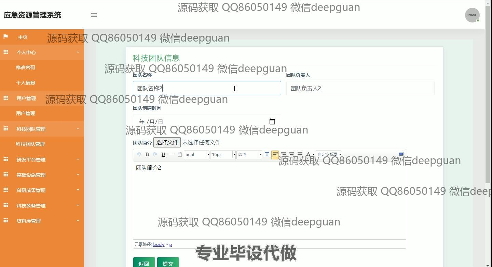
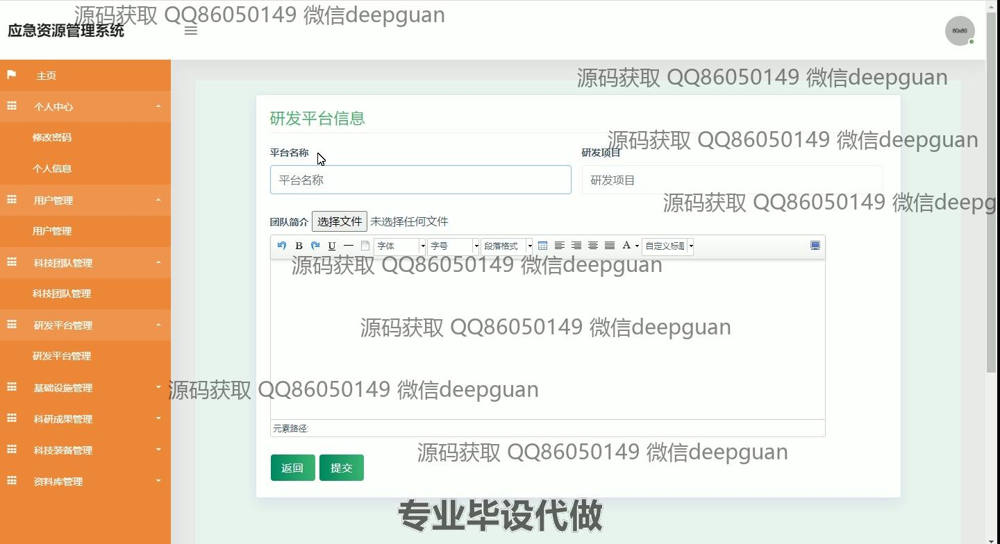
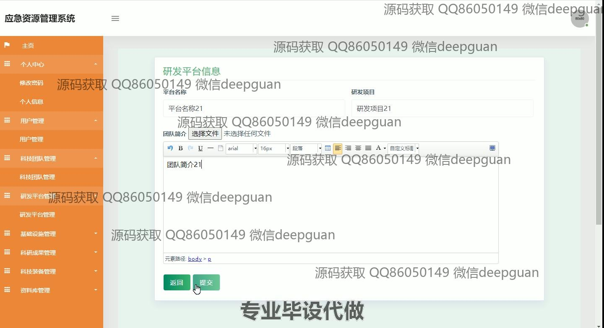
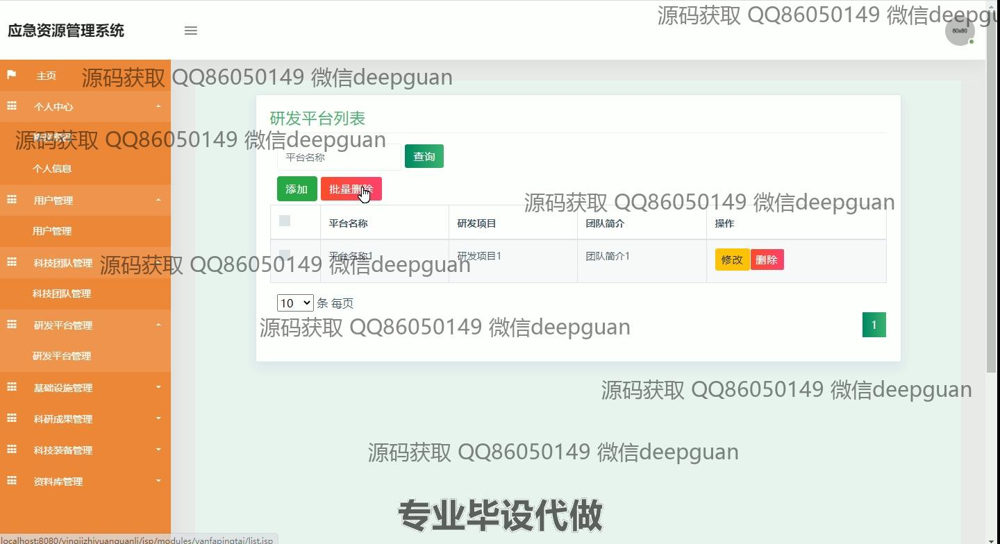
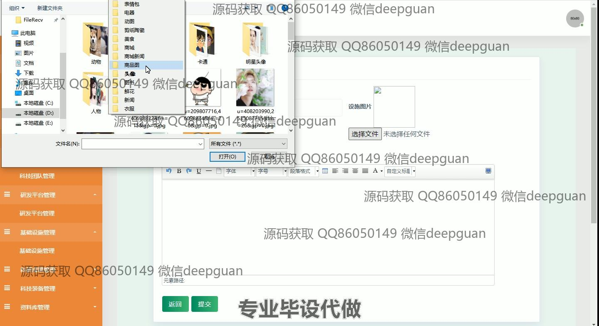
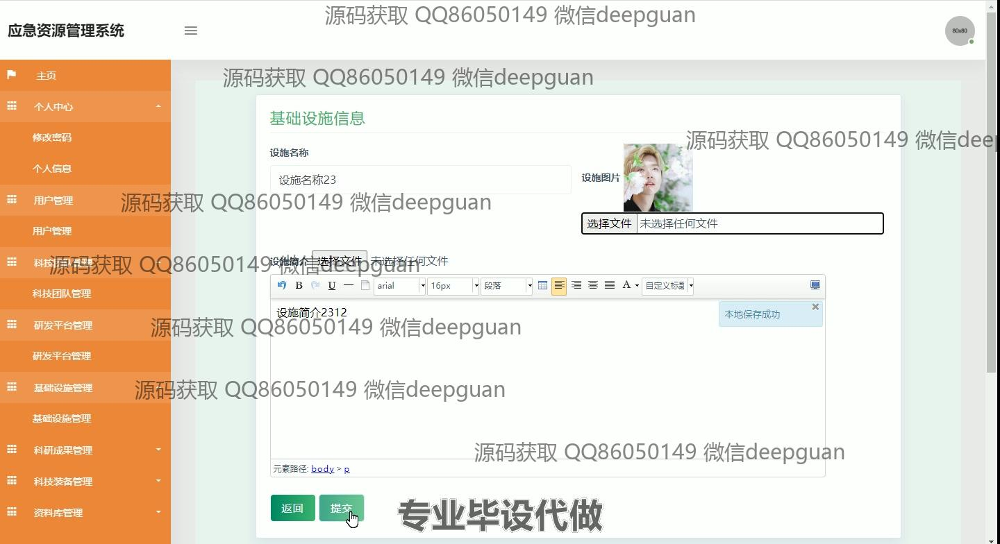
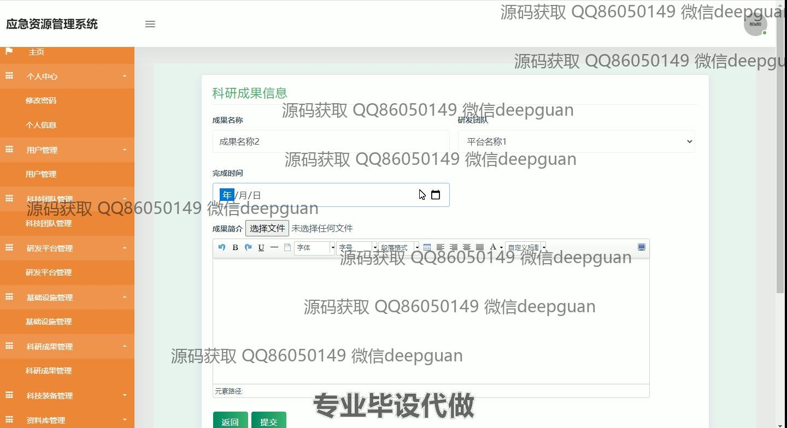
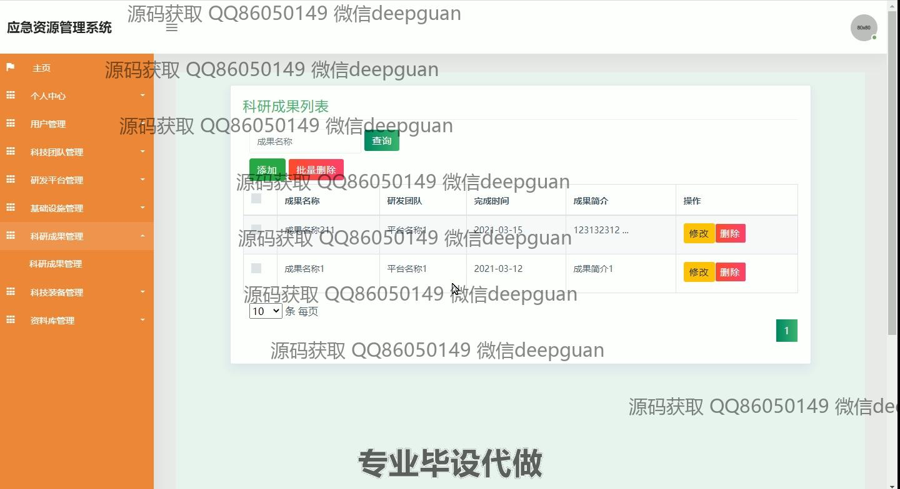
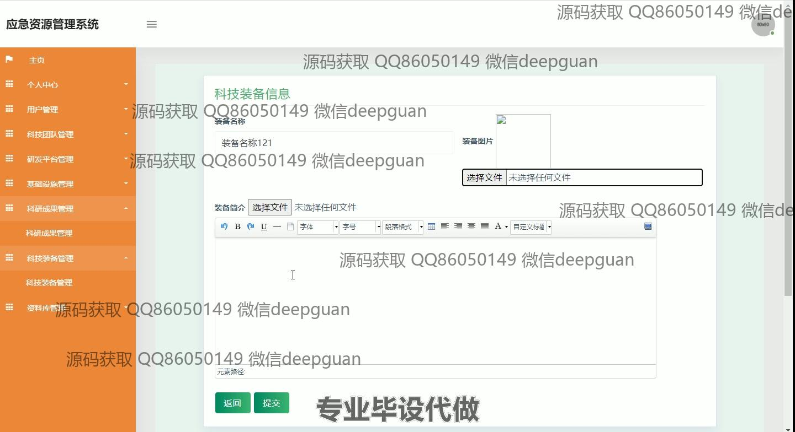
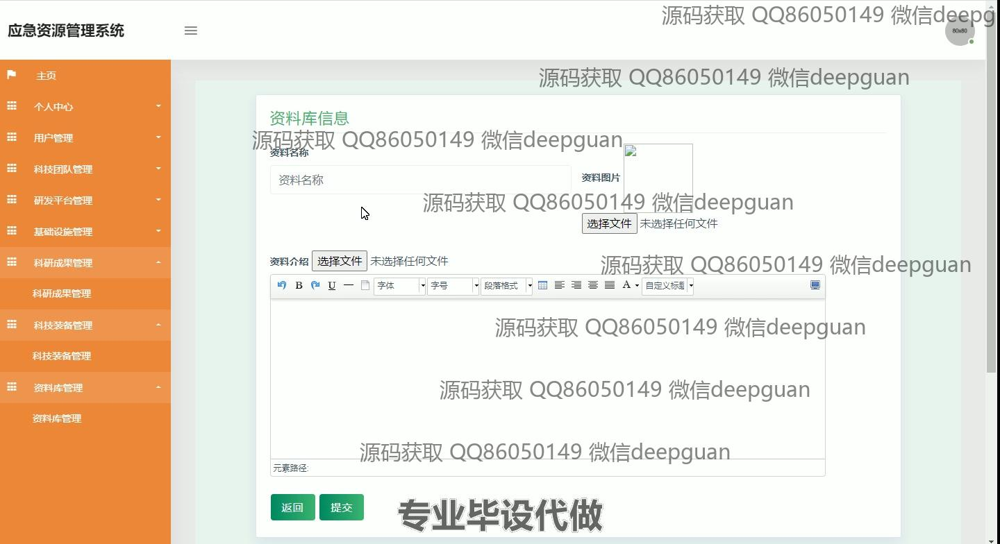
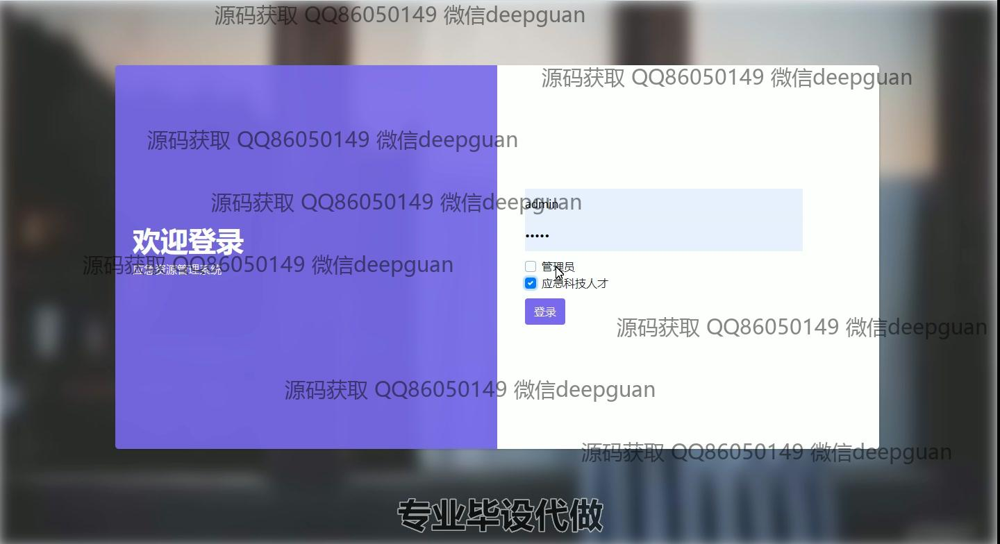
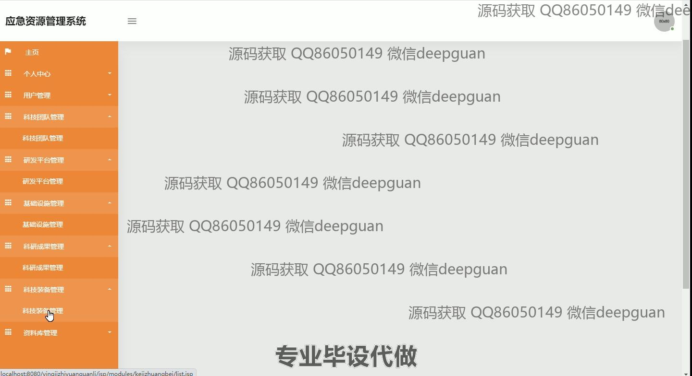

本代码来源于网络,仅供学习参考使用!

